slidenumbers: true

## Introduction to tvOS, using Swift 3

---
#

Hi, I'm Durul. I mostly building iOS, watchOS and tvOS. I am working at thinkful and freelance developer.

> Twitter : [@duruldalkanat](http://www.twitter.com/duruldalkanat)
> Portfolio: [Durul Dalkanat](http:/durul.github.io)

---

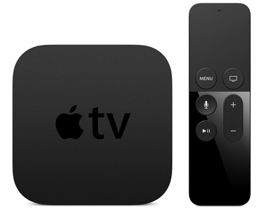
# Agenda
- tvOS History
- tvOS Architecture
- Differences of tvOS from iOS
- Limitations
- tvOS Design Tools
- Adding tvOS support to existing apps.

---

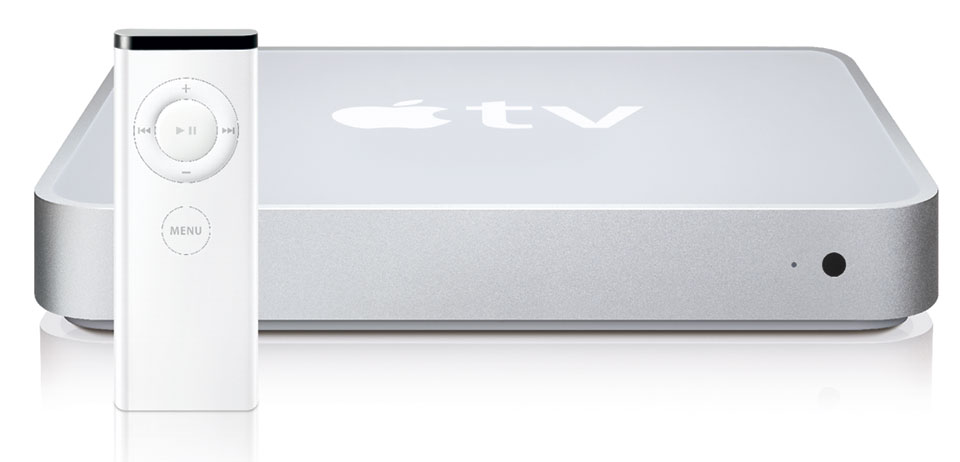
# tvOS History

^ Apple has actually had a product called "Apple TV" since 2007, but it wasn't until 2010 Apple did not started to mainstream. We called Apple TV 2. Apple added third party apps: YouTube, Netflix, NBA, NHL, Hulu and HBO. Apple TV was largely limited to iTunes media at first, in 2012 Apple released Apple TV 3. We said good bye jailbreak.

---

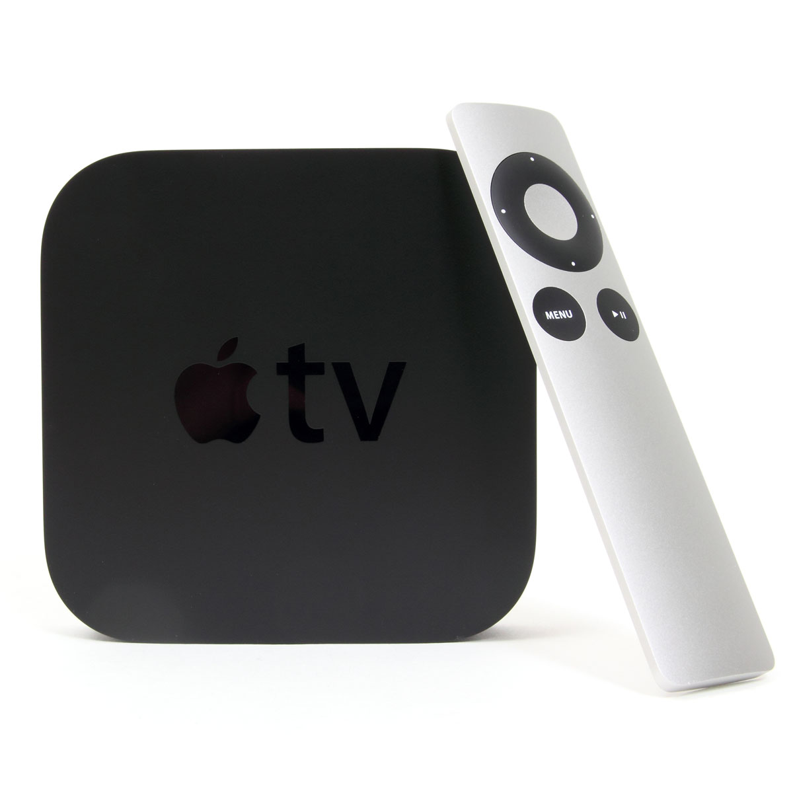
# tvOS History

^ Apple has actually had a product called "Apple TV" since 2007, but it wasn't until 2010 Apple did not started to mainstream. We called Apple TV 2. It was largely limited to iTunes media at first, in 2012 Apple releases  Apple TV 3. We said good bye jailbreak. But Apple added third party apps: YouTube, Netflix, NBA, NHL, Hulu and HBO.

^ What innovations have been published in the Apple TV 3. If you leave the phone on the Apple TV.

^ All of these apps were added in Apple's closed system. There was no App Store. That all changed with the announcement of tvOS and the 4th Generation of Apple TV.

---

<!--  -->
# tvOS History

^ All of these apps were added in Apple's closed system. There was no App Store. That all changed with the announcement of tvOS and the 4th Generation of Apple TV.

---

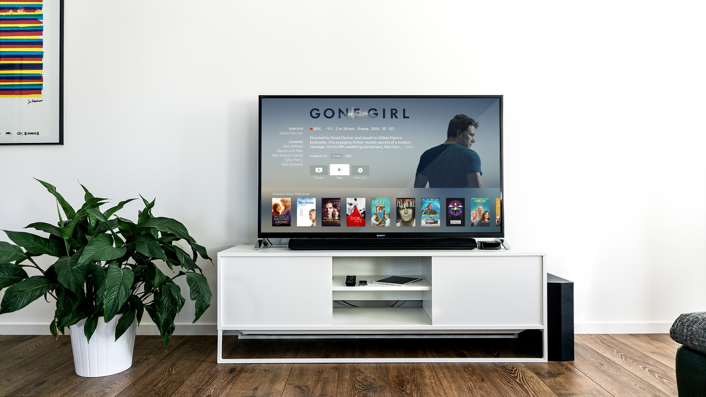
# Architecture

- TVML Apps
- Traditional Apps

^  There are two different ways to make apps on tvOS: TVMLApps: We can coding tvOS apps with TVML and TVJS.
^  Traditional Apps: We can coding apps in Swift or Objective-C, using frameworks from iOS like UIKit, AVFoundation, StoreKit, and more.

---

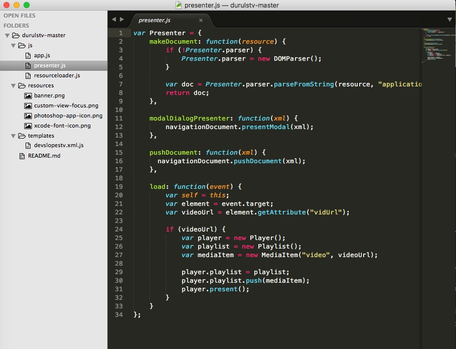
# TVML Apps
###  Apple provides 18 templates for building TVML files.

TVML app, consist of a few different frameworks:
> TVMLKit and TVMLKit JS .

^ TVML apps aren't like anything we've seen in iOS. TVML is the tvOS answer to web apps. JavaScript handles all the app logic for user interaction and navigation. TVML is a form of XML and stands for “Television Markup Language”.
^  Apple uses the term client-server apps. we can deploy an app to the app store, and then change its content, behavior, or appearance, without having to go back through app review.
^  Why TVML ? you have content on a server and you want to display that content to users. Your content is organized and it should be familiar.
^  TVML: The first way to make tvOS app is with TVML and TVJS.
^  TVMLKit JS is a JavaScript API framework specifically designed to work with Apple TV and TVML.
It’s the link between TVML, Javascript and the final tvOS app.
^  TVJS is new programming language created for tvOS apps. This is JavaScript framework.

---

# Demo

---

# Pros TVML
    • Designed for existing Media Servers
    • Leverages existing JavaScript expertise and code
    • Uses predefined UI
    • Does not require app review for JavaScript deployment
    • You can change after when your app approval

---

# Traditional Apps

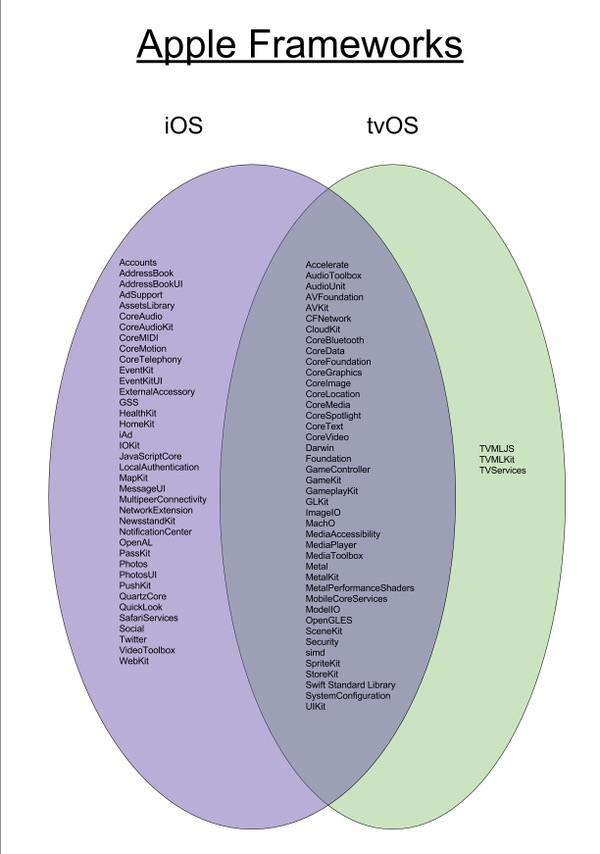

---

# Pros Traditional Apps
      • Leverages existing native expertise and code
      • Allows custom UI
      • Seamless integration with native frameworks
      • Standalone works
      • Use iCloud
      • Using open source libraries with Cocoapods
---  

# Demo

---

## Differences of tvOS from iOS
- Focus
- App Icon Parallax Effect

---

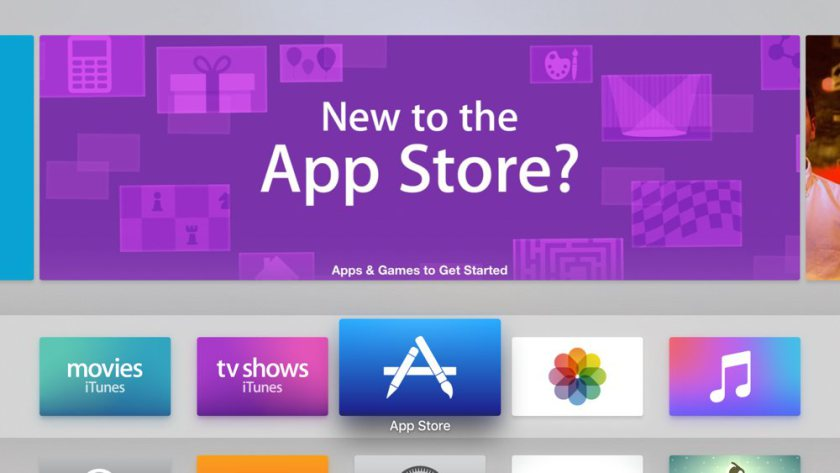
# Focus
      • UIButton
      • UIControl
      • UITableView
      • UICollectionView
      • UITextField
      • UIImageView
      • UISearchBar

^ This is a new challenge: we are navigating an app without touch input.
^ UIKit classes come ready-to-go with focus updates.
^ These classes include focus updates.
^ Each of these classes implements comes their own focus animation and behavior,
^ But UIImageView class requires small change to get focus working.

---

# App Icon Parallax Effect

tvOS comes a built-in parallax previewer.

- [Download Apple’s Parallax Previewer](https:// developer.apple.com/tvos/download/)

^  We use this app to produce layered images for the Apple TV.
There’s only one size we need to account for on Apple TV: @1X. This means we don’t have to worry about scaling images for Retina devices!
^  The app icon can be created using different image layers, and the system automatically create the parallax effect for you, no extra work needed.
^  We can export .lsr file (Apple's propriety layered file format) that we can import in to the Parallax Previewer tool to see the layer hierarchy/structure.

---

# Limitations
- No push notifications
- No browser support
- No web views
- No badges
- No permitted to write storage32 GB & 64 GB

^ First, tvOS provides no browser support of any kind, nor is there any WebKit or other web-based rendering engine you can program against. This means our app can’t link out to a web browser for anything, including web links, OAuth, or social media sites.

^ Second, tvOS apps cannot explicitly use local storage. At product launch, the devices ship with either 32 GB or 64 GB of hard drive space, but apps are not permitted to write directly to the on-board storage.

^ tvOS app bundle cannot exceed 4 GB.

---

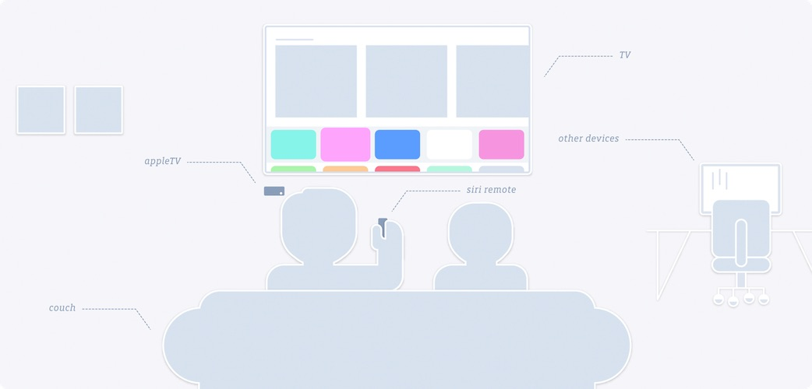
## tvOS Design
- Principles
      1. Space
      1. Icon
      1. Top Shelf

^  Keep a few points when designing user interactions for tvOS app
^  Consider the user’s distance from the TV screen.
^  App’s icon should make a great impression on Home screen.
^  When designing your apps. we should standardize on a 1920x1080 (1080p) resolution

---

## Top Shelf

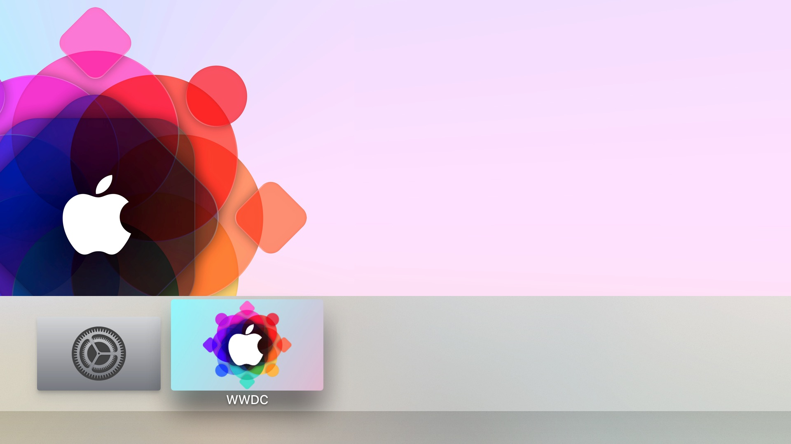

^  The top shelf is a content showcase area above the top row of apps on the Apple TV Home screen.

---

## tvOS Design
^  The remote is the primary input mechanism.
^  Standard gestures will not work. Such as tap, swipe, click.
^  Remote doesn’t support multi-touch gestures. Such as pinch to zoom or rotate custom gestures.
^  Game controllers handles by tvOS.
^  Apple says, Remote and game controllers IBOutlets should always behave as expected in our apps and games.

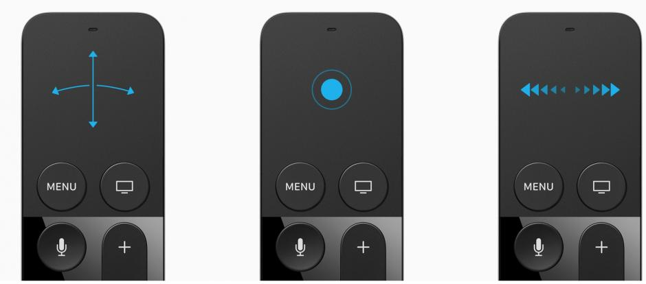

---

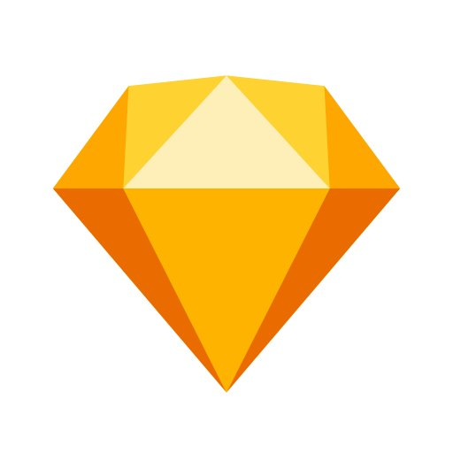
## tvOS Design Tools Sketching
- Sketching and wireframing
      1. Sketch [^1].
      1. Adobe Photoshop
      1. Invision

[^1]: tvOS Human Interface Guidelines Resources [website](https://developer.apple.com/tvos/human-interface-guidelines/resources/).

---

## tvOS gui Sketch

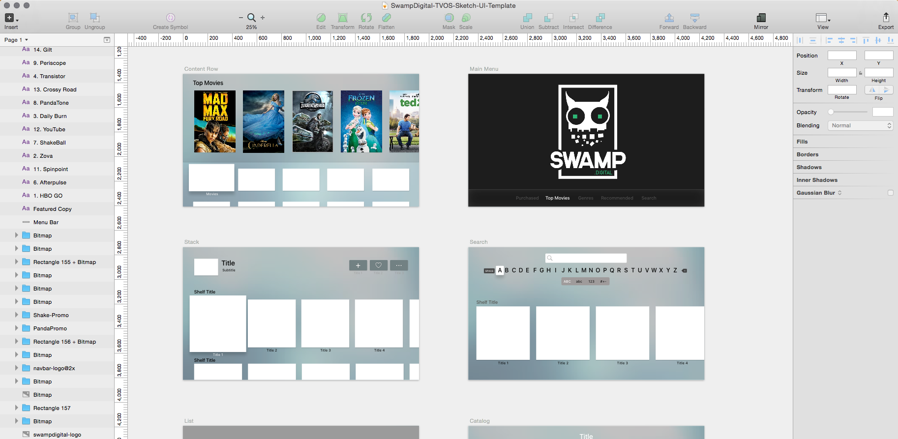

---

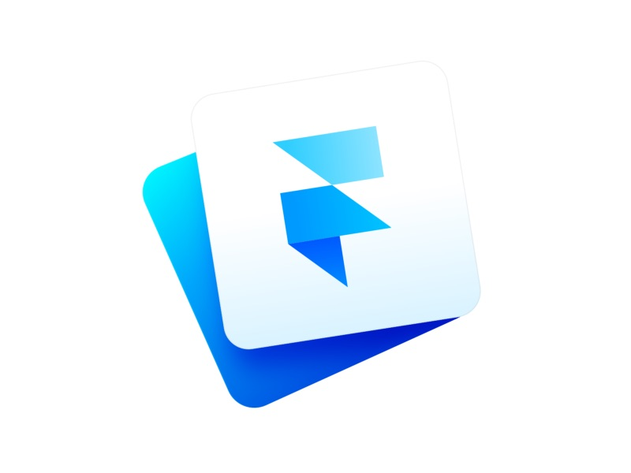
## tvOS Design Tools Prototyping
  - Prototyping and testing
      1. Flinto
      1. Framer.js
      1. Principle
      1. Proto.io

^  My favorite tool is Flinto.

---

## Remote

- AirPods and Apple bluetooth keyboard support.

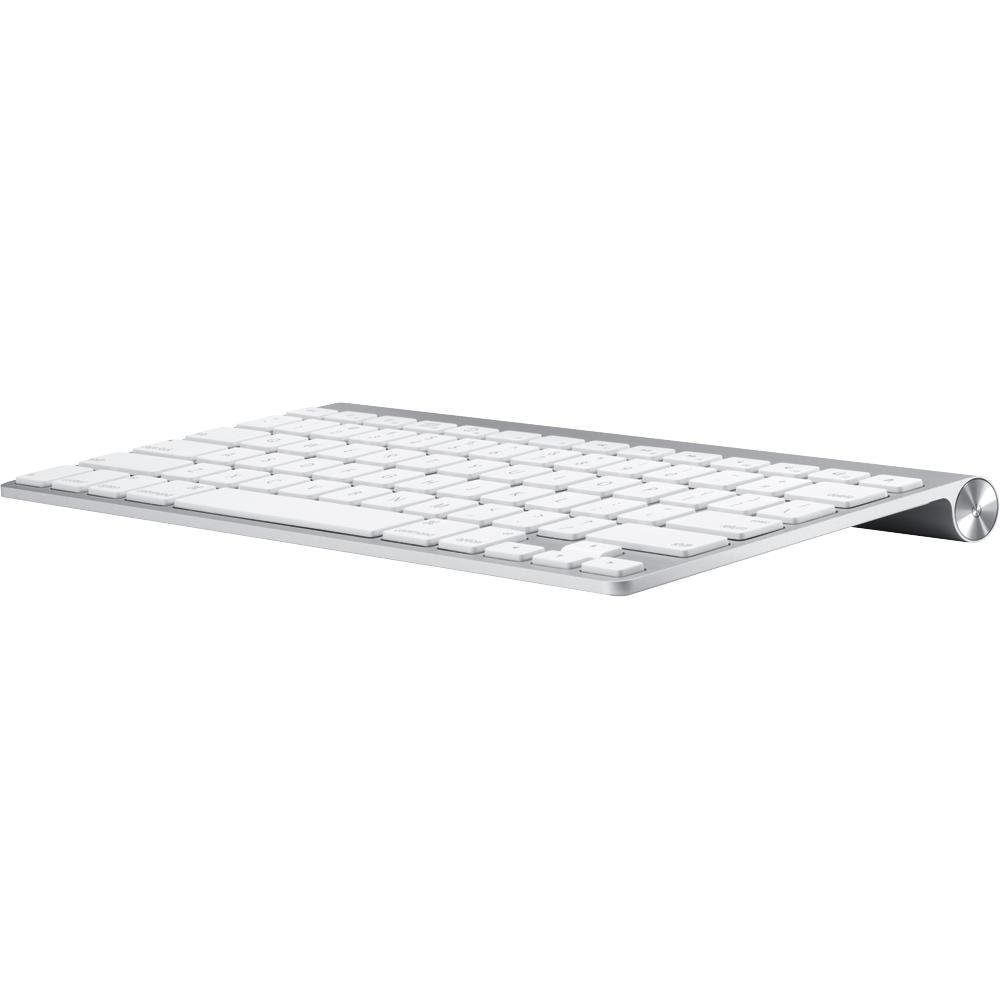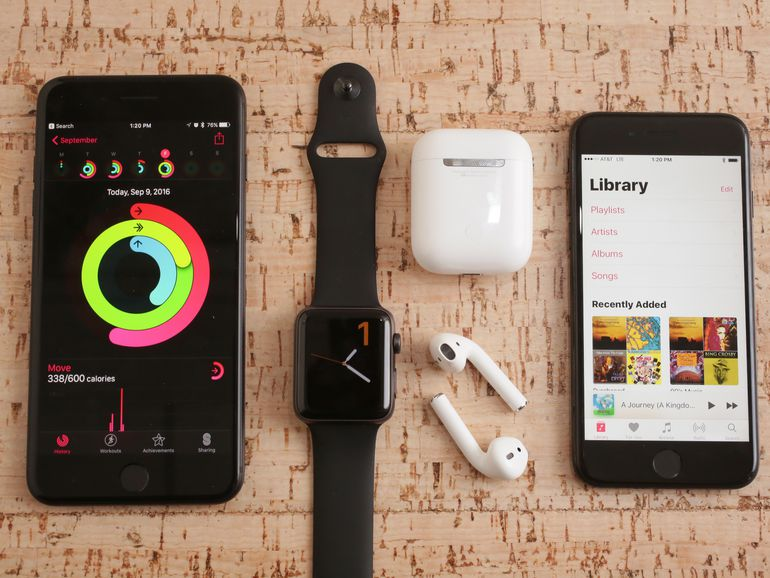

---

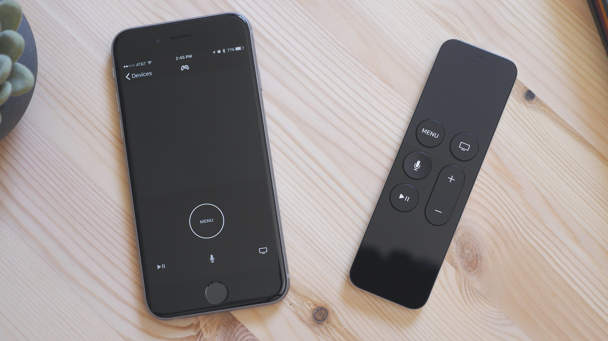

## Links
  - [DeveloperLibrary](https://developer.apple.com/library/content/navigation/#section=Technologies&topic=TVMLKit)
  - [Programming Guide](https://developer.apple.com/library/prerelease/tvos/documentation/General/Conceptual/AppleTV_PG/YourFirstAppleTVApp.html)
  - [tvOS Github resources](https://github.com/sanketfirodiya/tvOS)
  - [Eurosport](https://github.com/durul/eurosport)
  - [TVML Catalog](https://developer.apple.com/library/content/samplecode/TVMLCatalog/Introduction/Intro.html)
  - [UIKit Catalog (tvOS)](https://developer.apple.com/library/content/samplecode/UICatalogFortvOS/Introduction/Intro.html)

---

## Adding tvOS support to existing apps.
---

## Questions ?
---
